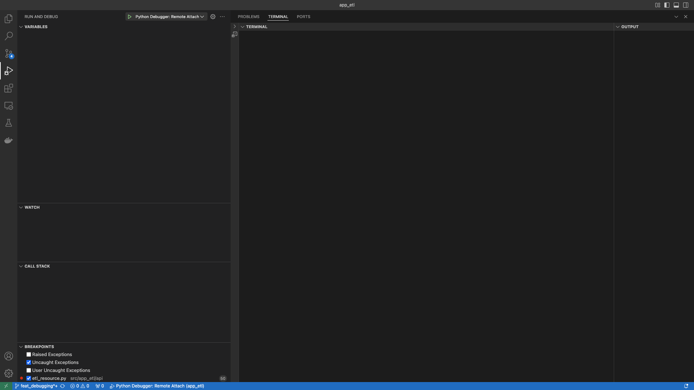
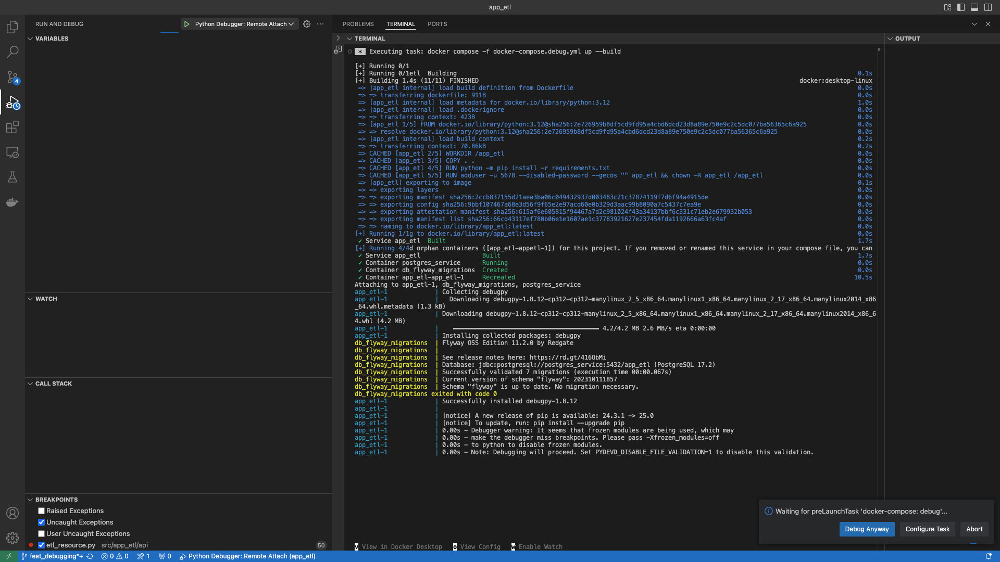

# app_flask_archetype


##  Objectives
- A Flask archetype project with common patterns to enable focusing on the unique aspects of your application instead of setup ceremony.
- Features:
    - HTTP REST API
        - [Application Logic Resource](src/app_flask_archetype/api/api.py)
        - [Health Check Resource](src/app_flask_archetype/api/health_check.py)
        - [Input Validator](src/app_flask_archetype/api/validator.py)
    - [External API Gateway](src/app_flask_archetype/gateway/external_api.py)
    - [Repository Pattern implemented with SQLAlchemy and Postgres](src/app_flask_archetype/repository/computation_result_repository.py)
    - [Alembic Migrations](src/app_flask_archetype/migrations/versions)
    - [Tests](tests/app_flask_archetype)

## Project Structure
- docs: Project documentation lives in here.
- src: production code lives in folder and is divided in the modules below:
    - app_flask_archetype: Project package.
        - api:
            - The API to the application lives in this module.
            - The current implementation is a REST API, but a gRPC, CLI API, etc would be implemented in here.
        - config:
            - Configurable values live in here.
            - These are values such as Hand Ranks, Card Ranks.
                - as the system scales, you could migrate these into a database to allow independently
                changing config without restarting the application.
        - core:
            - The domain logic of the application lives in this module.
        - gateway:
            - All external interaction objects(e.g. files, external APIs etc) live in this module.
        - model:
            - The domain models for the project live in this in this module.
        - repository:
            - Data interactions(persistence and access) concerns live in this module.
        - app.py:
            Entry point to startup the application
- tests: Test code lives in folder.
    The tests are intentionally separated from production code.
    - benefits:
        - Tests can run against an installed version after executing `pip install .`.
        - Tests can run against the local copy with an editable install after executing `pip install --edit`.
    - [more in depth discussion here](https://docs.pytest.org/en/latest/explanation/goodpractices.html#choosing-a-test-layout-import-rules)

- utilities: Any useful scripts, such as curl & postman requests, JSON payloads, software installations, etc.

## Dependencies
- [Docker](https://docs.docker.com/get-started/)

## Package Management
- [Pipenv](https://pipenv.pypa.io/en/latest/)
    - [Quick Reference](https://pipenv.pypa.io/en/latest/cli.html#install)

## Setup Instructions
- The repository is configured to use [devcontainers](https://containers.dev) for development.
    - [Developing inside a Container](https://code.visualstudio.com/docs/devcontainers/containers)

## Usage
- Project Conversion
    ```shell
    #target_app_name is desired project name
    ./convert_project.sh target_app_name
    ```
- Steps Executed:
    - Renames all occurrences of `app_flask_archetype` to `target_app_name`
    - Optional Step: Rename the project folder to user desired project name.
    This is a manual step, it is the folder you cloned this repository into.
   
## Run Program
- The system automatically starts up as part of loading the project into an editor that supports devcontainers.
    - If you would like to run the prod image, change `dockerfile: Dockerfile.dev` to `dockerfile: Dockerfile` in [docker-compose](docker-compose.debug.yaml).

- Run an endpoint.
    ```shell
    # specifically imports malaria_annual_confirmed_cases
    ./utilities/curl/malaria/who_malaria_annual_confirmed_cases.sh
    ```

- Debugging
    - Running in debug mode and debug with VSCode:
        - Open the "Run and Debug" view.
        - Execute the "Python Debugger: Remote Attach" task.
            <br>
        - Allow debugging without frozen modules by clicking "Debug Anyway" once the debugger is installed and ready.
            
        - The server will inform you the host and port in the terminal output at the bottom.<br>
        - Debug you normally do(i.e. add break points, step into code definitions, evaluate code snippets, etc) <br>

    - If you would like to debug the prod image, change `dockerfile: Dockerfile.dev` to `dockerfile: Dockerfile` in [docker-compose.debug](docker-compose.debug.yaml).

## Testing
- ### Execute Unit Tests
    ```shell
    pytest tests/app_flask_archetype/unit
    ```
- ### Execute Integration Tests
    ```shell
    pytest tests/app_flask_archetype/integration
    ```
- ### Execute Spellcheck
    ```shell
    pyspelling -c spellcheck.yaml
    ```
- ### Execute System Tests
    ```shell
    Not Implemented
    ```

## Database State Management
- The database state (i.e. tables, stored procedures, indexes, etc) are managed using [Alembic](https://alembic.sqlalchemy.org/en/latest/).
    - Migrations location: src/app_flask_archetype/migrations
    - Migrations naming scheme: YYYY_MM_DD_HHMM_rev_name
        - uses alembic's full revision scheme defined in alembic.ini
        - example: `2025_02_10_1349-9e2772c6755f_create_schema_computation.py`
    - Current database state can be queried with `SELECT * FROM public.alembic_version;`
- To upgrade the database to latest migrations:
    ```shell
    alembic upgrade head
    ```
- To downgrade the database to the base state:
    ```shell
    alembic downgrade base
    ```

## Spell Check
```shell
pyspelling -c spellcheck.yaml
```

## Git Conventions
- **NB:** The main is locked and all changes must come through a Pull Request.
- Commit Messages:
    - Provide concise commit messages that describe what you have done.
        ```shell
        # example:
        git commit -m "feat(core): algorithm" -m"implement my new shiny faster algorithm"
        ```
    - References:
        - https://www.conventionalcommits.org/en/v1.0.0/
        - https://www.freecodecamp.org/news/how-to-write-better-git-commit-messages/

## Demo:

**Disclaimer**: This is still work in progress.
